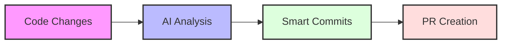

# KVY GitSense

Transform your Git workflow with AI-powered commit messages and PR automation.

## 🎯 What it does

## Core Features

- Generate meaningful commit messages using AI
- Create PRs with context-aware descriptions
- Manage your Git workflow directly in VS Code

## Roadmap

- Code convention validation
- Automated changelog generation
- Release management
- Your suggestions welcome!

## 🤝 Contributing

Fork the repo
Create your feature branch
Submit a PR
See CONTRIBUTING.md for detailed guidelines.

## 🔗 Links

Built with ❤️ by [KVYTech](https://kvytechnology.com/)
