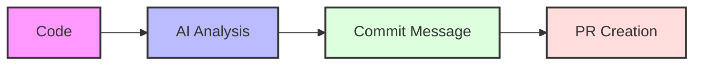

# KVY GitSense

Internal VS Code extension for automating our Git workflows.

## 🎯 Features

```mermaid
graph LR
    A[Code] --> B[AI Analysis]
    B --> C[Commit Message]
    C --> D[PR Creation]
    
    style A fill:#f9f,stroke:#333,stroke-width:2px
    style B fill:#bbf,stroke:#333,stroke-width:2px
    style C fill:#dfd,stroke:#333,stroke-width:2px
    style D fill:#fdd,stroke:#333,stroke-width:2px
```

### Current

- AI-generated commit messages based on your changes
- PR creation with smart descriptions
